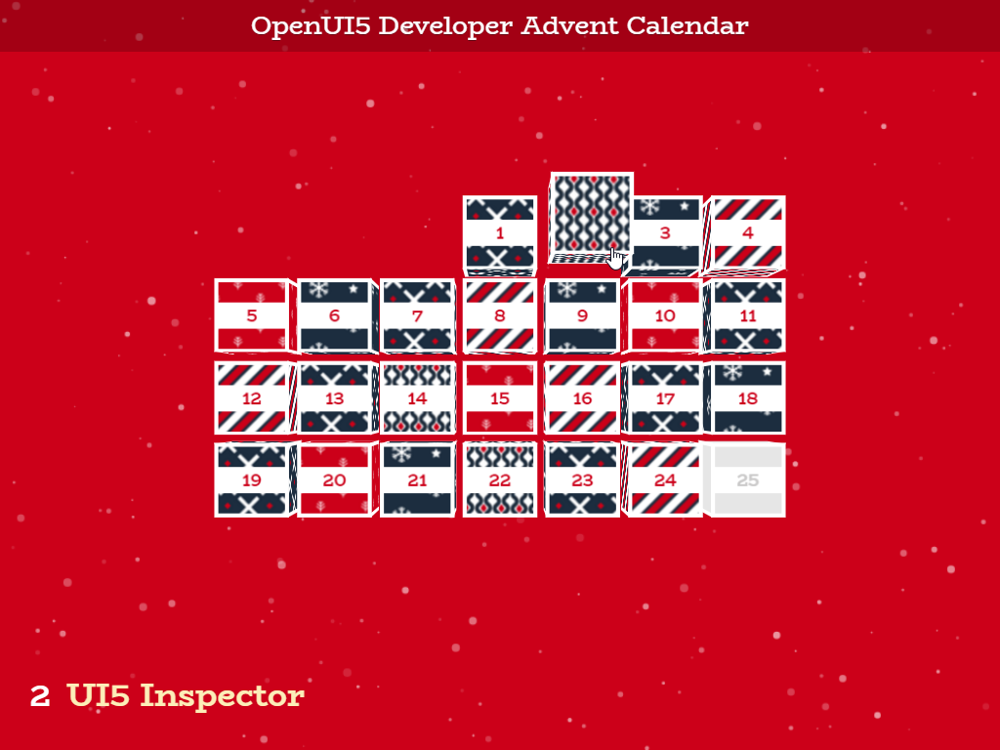

# Advent Calendar
## [OpenUI5 Developer Blog](http://openui5.blogspot.com/2016/12/advent-calendar.html)

>UI5 demo showing an advent calendar with links to interessting topics concerning UI5 development.
> 
>The demo is a UI5 wrapper for Mary Lou's Codrops Cubes Advent Calendar blog [Cubes Advent Calendar](http://tympanus.net/codrops/2016/11/09/cubes-advent-calendar/?utm_source=codropscollective)
>I wrapped her code into UI5 and added a link for each day as a small gift. 
>
>The code uses most up-to-date browser features and is highly experimental (not thought to be used for productive apps). It should only demonstrate some browser features and be a nice giveaway for XMas.

### [Online Demo (SAP HCP)](https://adventcalendar-p1940953245trial.dispatcher.hanatrial.ondemand.com/index.html)

### Highlights

> - custom control to generate needed DOM elements from xml view
> - leveraging some nice javascript libraries like anime.js and letter effects
> - collection of interessting articles concerning UI5 developent
